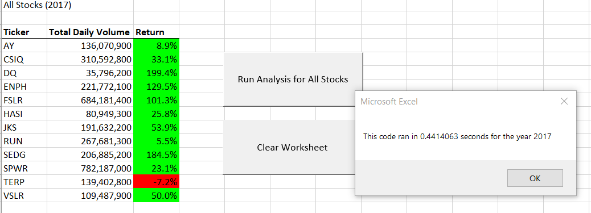
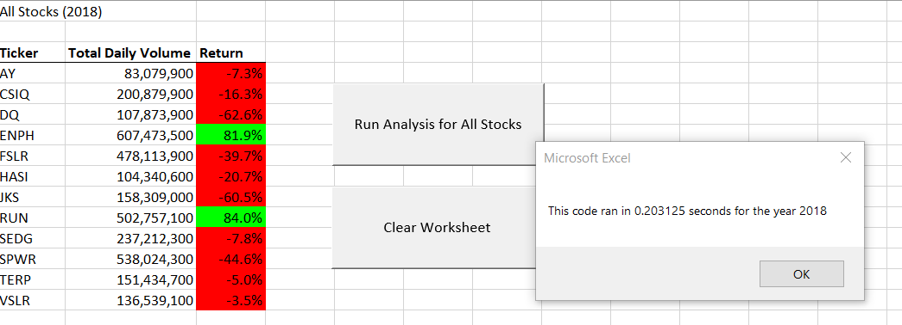

# **Results of Refactored Stock Analysis VBA Script**

## *Overview of Project*
My client Steve requested an updated Excel workbook to quickly analyze the entire stock market over the last few years using macros/VBA Script. I have refactored the VBA script I used to create a green stocks analysis for Steve's parents to handle the expanded datasets and make the VBA script run faster.

## *Results*
### **2017 Stock Performance:**
In 2017 all stocks except TERP had a positive return, suggesting it was overall a year of high performance. The average return was 67.3%, with a maximum return of 199.4% for DQ. The highest performing stocks with returns greater than 100% were DQ, SEDG, ENPH, and FSLR. The lowest performing stocks were TERP, RUN, and AY with returns less than 10%. 


### **2018 Stock Performance:**
In sharp contrast to 2017, 2018 was overall a year of low performance. The average return was -8.5% with only ENPH and RUN having positive returns; both ENPH and RUN had strong positive returns of greater than 80%.


### **All 2017-2018 Stock Performance:**
Between 2017 and 2018 the majority of stocks had overall positive average returns, with only JKS, SPWR, and TERP having overall negative average returns. ENPH had the highest performance with an overall average return of 105.7%. The other high performers with strong overall average returns greater than 10% were SEDG, DQ, RUN, FSLR, and VSLR. The low performers were CSIQ, HASI, AY, JKS, TERP, and SPWR with overall average returns less than 10%.


However, I would advise Steve to consider analyzing a larger range of stock market performance datasets before making investment decisions. Analyzing five years or more of stock market performance will give Steve a much better view of the average return of investment.

### **VBA Script Execution Times:**
My original VBA Script before refactoring executed in the following times:


My refactored VBA Script before refactoring executed in the following times:





The performance of the refactored VBA Script was a resounding success, with the execution times dropping from nearly 15 seconds to less than 1 second. The greatest improvement made in the refactored VBA Script was declaring output arrays instead of variables for tickerVolumes, tickerStartingPrices, and tickerEndingPrices:  

```
Dim tickerVolumes(12) As Long
Dim tickerStartingPrices(12) As Single
Dim tickerEndingPrices(12) As Single
```
This allowed the refactored VBA Script to loop through those arrays to output the Ticker, Total Daily Volume, and Return data rather than just outputting the data for the current ticker as in the original VBA Script:
```
For i = 0 To 11
                
        Worksheets("All Stocks Analysis").Activate
        Cells(4 + i, 1).Value = tickers(i)
        Cells(4 + i, 2).Value = tickerVolumes(i)
        Cells(4 + i, 3).Value = tickerEndingPrices(i) / tickerStartingPrices(i) - 1
        
    Next i
```

## *Summary*
### **What are the advantages or disadvantages of refactoring code?**
Some *advantages* of refactoring code are : 
1) Improving the execution time of the code.
2) Improving code readability through less repetition, additional comments, etc. 
3) Decreasing potential errors/bugs in the code. 
4) Making specialized code available for broader applications. 

Some *disadvantages* of refactoring code are: 
1) Accidentally removing important functions of the original code. 
2) Accidentally changing important functions of the orignal code.
3) Wasting time and resources if the refactoring does not significantly improve the original code.

### **How do these pros and cons apply to refactoring the original VBA script?**
In the case of this project, the refactored VBA Script delivered only pros. The execution time was reduced by over 14 seconds and the refactoring allowed the code to process larger datasets more easily by repeating less and requiring fewer updates to the declared arrays and variables. This refactored code could be used to efficiently analyze long-term stock market performance of five years or more, which may be more useful for my client Steve than the two year short-term analysis conducted. 
